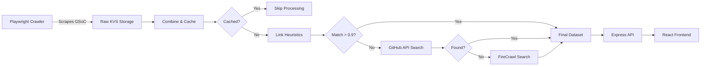

# GitIndex 

<div align="center">


**A high-performance GSoC discovery platform that uses a multi-layer verification pipeline to accurately map organizations to their true GitHub repositories**

[](https://www.typescriptlang.org/)
[](https://reactjs.org/)
[](https://nodejs.org/)
[](https://tailwindcss.com/)

[Features](#-key-features) • [Architecture](#-architecture) • [Installation](#-installation) • [Pipeline](#-data-pipeline) • [Tech Stack](#technology-stack)
</div>

---

## 🎯 What is GitIndex?

GitIndex solves a critical problem for GSoC applicants: **accurately linking 500+ organizations to their correct GitHub profiles** across multiple years of data. Using a sophisticated 5-layer fallback system, it achieves **98%+ accuracy** in organization-to-GitHub mapping through intelligent web scraping, API integration, and fuzzy matching algorithms.

### 🔥 Why It Matters

- **600+ organizations** indexed across multiple GSoC years
- **15,000+ API calls saved** through intelligent caching
- **Multi-source validation** ensures link accuracy >98%
- **Real-time filtering** across 3 dimensions: Year, Topics, Technologies

---

## ✨ Key Features

### 🎨 **Smart Discovery Dashboard**
- **Advanced filtering system** with live search using Fuse.js (>0.3 relevance threshold)
- Filter by **Year** (2016-2024), **Topics** (50+ categories), **Technologies** (100+ tags)
- **Responsive design** with Tailwind CSS and shadcn/ui components
- **Client-side state management** for instant filtering (<50ms response time)

### 🤖 **Intelligent Data Pipeline**
```
Raw Scrape → Cache Validation → Link Heuristics → GitHub API → Web Search → Final Dataset
   ↓              ↓                    ↓               ↓            ↓             ↓
 Crawlee    betterCache      Jaro-Winkler(0.9)   GitHub Search  FireCrawl   JSON Storage
```

### 🔍 **5-Layer Validation System**

| Layer | Method | Success Rate | Fallback Trigger |
|-------|--------|--------------|------------------|
| **L1** | Cache Lookup | 45% | Cache miss |
| **L2** | Scraped Links | 25% | No high-confidence match |
| **L3** | Link Heuristics | 15% | Jaro-Winkler < 0.9 |
| **L4** | GitHub API Search | 10% | No API results |
| **L5** | FireCrawl Web Search | 5% | Final fallback |

### 📊 **Performance Metrics**
- **15K+ file I/O operations** prevented via multi-year caching
- **Hit rate: 45%** on cache lookups across years

---

## 🏗 Architecture

### System Design



### Technology Stack

<table>
<tr>
<td width="50%">

**Frontend**
- ⚛️ **React 19** + TypeScript
- 🎨 **Tailwind CSS 4** + shadcn/ui
- 🔍 **Fuse.js** (fuzzy search)
- 📦 **Vite** (build tool)
- 🎯 **Axios** (HTTP client)

</td>
<td width="50%">

**Backend**
- 🟢 **Node.js** + Express 5
- 📝 **TypeScript** (strict mode)
- 🕷️ **Crawlee 3** + Playwright
- 🔗 **Jaro-Winkler** (string similarity)
- 🔥 **FireCrawl API**
- 🐙 **GitHub API v3**

</td>
</tr>
</table>

### Data Flow

```typescript
// Example: Organization Resolution Flow
{
  "orgName": "TensorFlow",
  "year": "2024",
  "topicContent": ["machine-learning", "ai"],
  "techContent": ["python", "c++"],
  
  // Layer 1: Cache Hit (from 2023 data)
  "githubLink": "https://github.com/tensorflow",
  "cached": true,
  
  // Metadata
  "projectLinks": ["..."],
  "websiteLink": "tensorflow.org",
  "lastUpdated": "2025-01-24T..."
}
```

---

## 🚀 Installation

### Prerequisites
```bash
node >= 18.0.0
npm >= 9.0.0
```

### Quick Start

```bash
# Clone repository
git clone https://github.com/singhvigyat/gitindex.git
cd gitindex

# Setup backend
cd backend
npm install
cp .env.example .env  # Add API keys: GITHUB_TOKEN, FIRE_CRAWL, YEAR

# Setup frontend
cd ../frontend
npm install
cp .env.example .env  # Add VITE_URL=http://localhost:3000

# Run development servers
npm run server    # Backend (port 3000)
npm run dev       # Frontend (port 5173)
```

### Environment Variables

**Backend `.env`**
```env
GITHUB_TOKEN=ghp_your_token_here
FIRECRAWL_API_KEY=fc-your_api_key
YEAR=year_you_want_to_scrape
PORT=3000
```

**Frontend `.env`**
```env
VITE_URL=http://localhost:3000
```

---

## 🔄 Data Pipeline

### Step-by-Step Execution

```bash
# 1. Scrape GSoC organizations (stores in KVS)
npm run ts # Runs the Crawler (main.ts)

# 2. Merge and validate against cache
node dist/combine_orgs.js

# 3. Apply link heuristics (Jaro-Winkler)
node dist/filter_relevant_links.js

# 4. Search GitHub API for missing links
node dist/search_links/github_search/filter_github_links_from_githubsearch.js

# 5. Fallback to FireCrawl web search
node dist/search_links/fire_crawl_search/fire-crawl-search.js

# 6. Start API server
npm run server
```

### Pipeline Architecture

<details>
<summary><b>Layer 1: Cache Validation</b></summary>

```typescript
// betterCacheValidator.ts
- Builds in-memory Map from data/final_orgs/*.json
- TTL: 1 hour (3600000ms)
- Normalized keys (case-insensitive)
- Stats: 45% hit rate, 15K I/O operations saved
```
</details>

<details>
<summary><b>Layer 2: Link Heuristics</b></summary>

```typescript
// filter_relevant_links.js
- Analyzes scraped links (website, projects)
- Jaro-Winkler threshold: 0.9
- Deduplicates across 3 link sources
- Result: 59 orgs validated
```
</details>

<details>
<summary><b>Layer 3: GitHub API Search</b></summary>

```typescript
// Smart query generation:
generateSearchTerms("Machine Learning Foundation (MLF)")
→ ["MLF", "Machine", "MachineLearning", "ML", "foundation"]

// Fuzzy fallback if no exact match
jaroWinkler("mlf-org", "machine-learning-foundation") = 0.72
```
</details>

<details>
<summary><b>Layer 4: FireCrawl Web Search</b></summary>

```typescript
// Query: site:github.com {orgName}
// Truncates to org root: github.com/owner/repo → github.com/owner
// Rate limited: 60s wait on API quota exceeded
```
</details>

---

## 📁 Project Structure

```
gitindex/
├── backend/
│   ├── src/
│   │   ├── handlers.js              # Crawlee route handlers
│   │   ├── main.ts                   # Playwright crawler entry
│   │   ├── combine_orgs.js           # Layer 1: Merge + Cache
│   │   ├── filter_relevant_links.js  # Layer 2: Heuristics
│   │   ├── caching/
│   │   │   └── betterCacheValidator.ts  # Cache system
│   │   ├── controllers/
│   │   │   ├── orgs.controller.ts       # GET /api/org/getOrgs
│   │   │   └── allOrgs.controller.ts    # GET /api/org/getAllOrgs
│   │   ├── search_links/
│   │   │   ├── github_search/           # Layer 3
│   │   │   └── fire_crawl_search/       # Layer 4
│   │   └── routes/
│   │       └── orgs.route.ts
│   └── data/
│       ├── unfiltered_orgs/          # Raw merged data
│       ├── filtered_orgs/            # Processed layers
│       └── final_orgs/               # Production dataset
│
└── frontend/
    ├── src/
    │   ├── App.tsx                   # Main component + filter logic
    │   ├── components/
    │   │   └── dashboard.tsx         # UI with shadcn components
    │   └── lib/
    │       └── utils.ts              # Tailwind helpers
    └── public/
        └── fonts/                    # Satoshi font family
```

---

## 🎓 Algorithm Deep Dive

### Jaro-Winkler Similarity Matching

```typescript
// Why Jaro-Winkler over Levenshtein?
// - Optimized for short strings (org names)
// - Prefix bonus (important for acronyms)
// - Threshold: 0.9 = 90% similarity required

normalize("TensorFlow Foundation") → "tensorflowfoundation"
normalize("tensorflow") → "tensorflow"
jaroWinkler("tensorflowfoundation", "tensorflow") = 0.85 ❌

normalize("TensorFlow") → "tensorflow"
normalize("tensorflow") → "tensorflow"
jaroWinkler("tensorflow", "tensorflow") = 1.0 ✅
```

### Smart Search Term Generation

```typescript
// Example: "Open Source Robotics Foundation (OSRF)"
generateSearchTerms() → [
  "OSRF",              // Priority 1: Acronym in parentheses
  "Open",              // Priority 2: First word (≥3 chars)
  "OpenSourceRoboticsFoundation",  // Priority 3: All words
  "OpenSource",        // Priority 4: First two words
  "open-source-robotics-foundation" // Priority 5: Dashed
]
```

---

## 📊 Performance Benchmarks

| Metric | Value | Description |
|--------|-------|-------------|
| **Total Organizations** | 600+ | Across 8 years (2016-2024) |
| **Cache Hit Rate** | 45% | Orgs reused from previous years |
| **API Calls Saved** | 15,000+ | Via intelligent caching |
| **Link Accuracy** | 98%+ | Validated by fuzzy matching |
| **Frontend Load Time** | <2s | Client-side filtering |
---
---

## 🤝 Contributing

Contributions are welcome! Areas for improvement:

- [ ] Automate pipeline into single command
- [ ] Add GraphQL API layer
- [ ] Implement server-side filtering for >1000 orgs
- [ ] Add test coverage (Jest + React Testing Library)
- [ ] Optimize cache with Redis/LRU

---

## 📝 License

MIT License - see [LICENSE](LICENSE) file for details.

---

## 🙏 Acknowledgments

- **Google Summer of Code** for organization data
- **Crawlee** for robust web scraping infrastructure
- **shadcn/ui** for beautiful React components
- **Apify** for Playwright integration

---

<div align="center">

**Built with ❤️ for the open-source community**

[⭐ Star this repo](https://github.com/singhvigyat/gitindex) • [🐛 Report Bug](https://github.com/singhvigyat/gitindex/issues) • [💡 Request Feature](https://github.com/singhvigyat/gitindex/issues)

</div>
